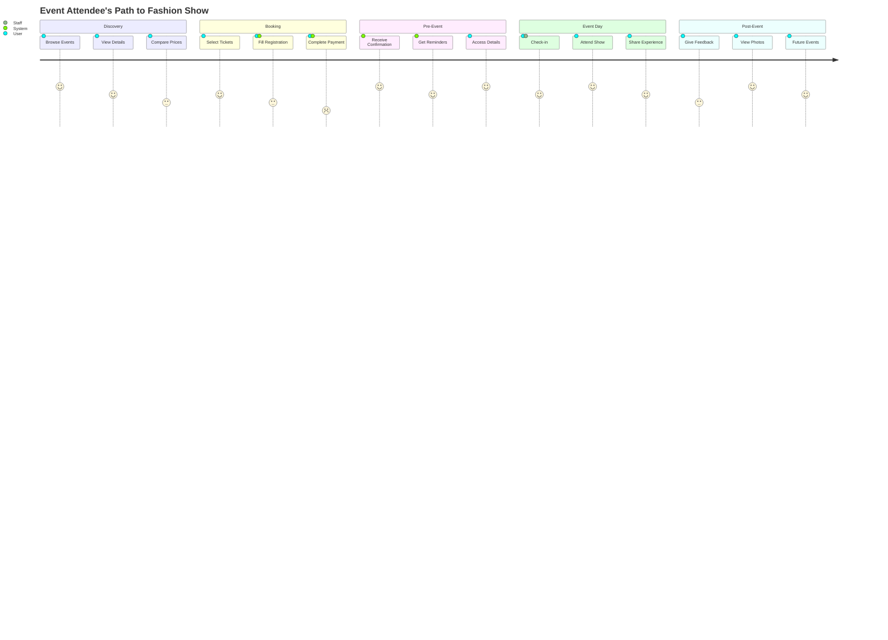
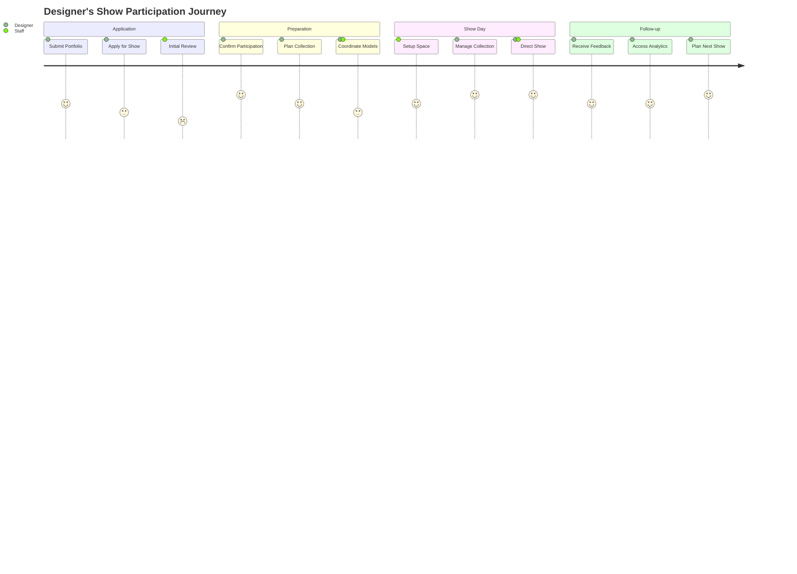
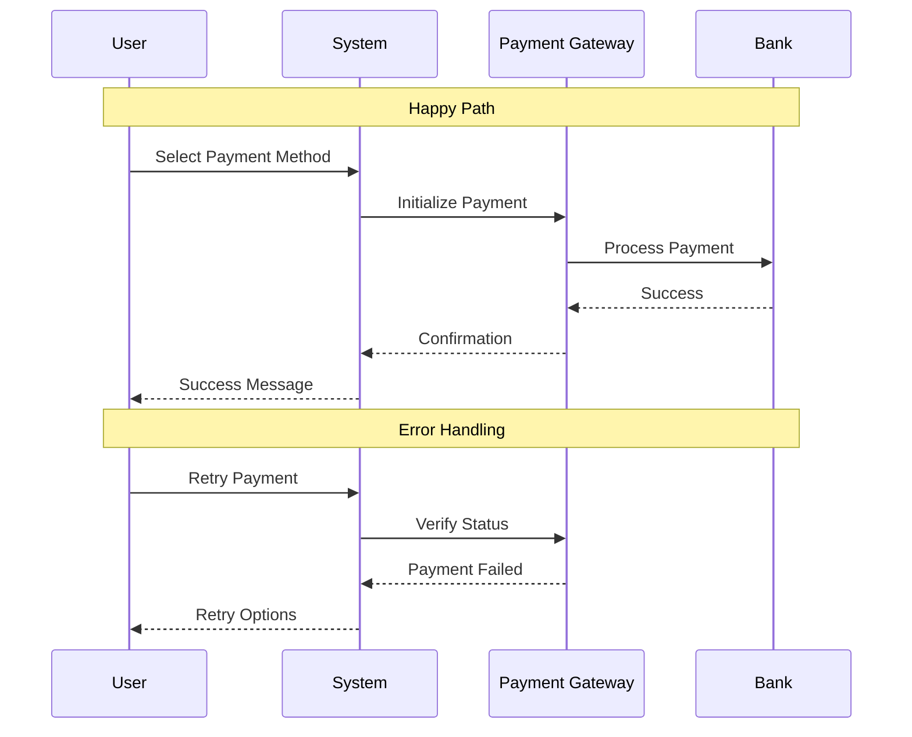
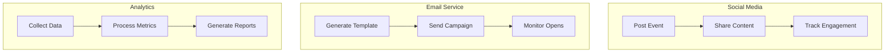
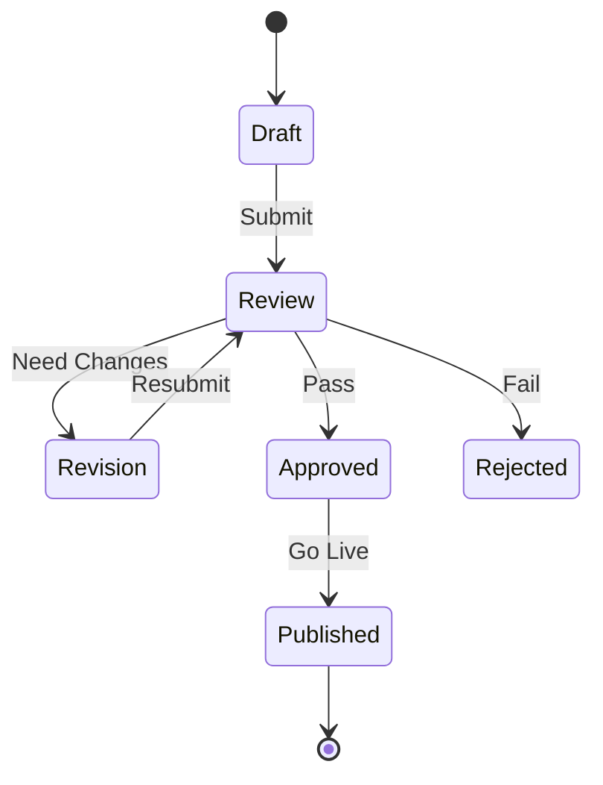
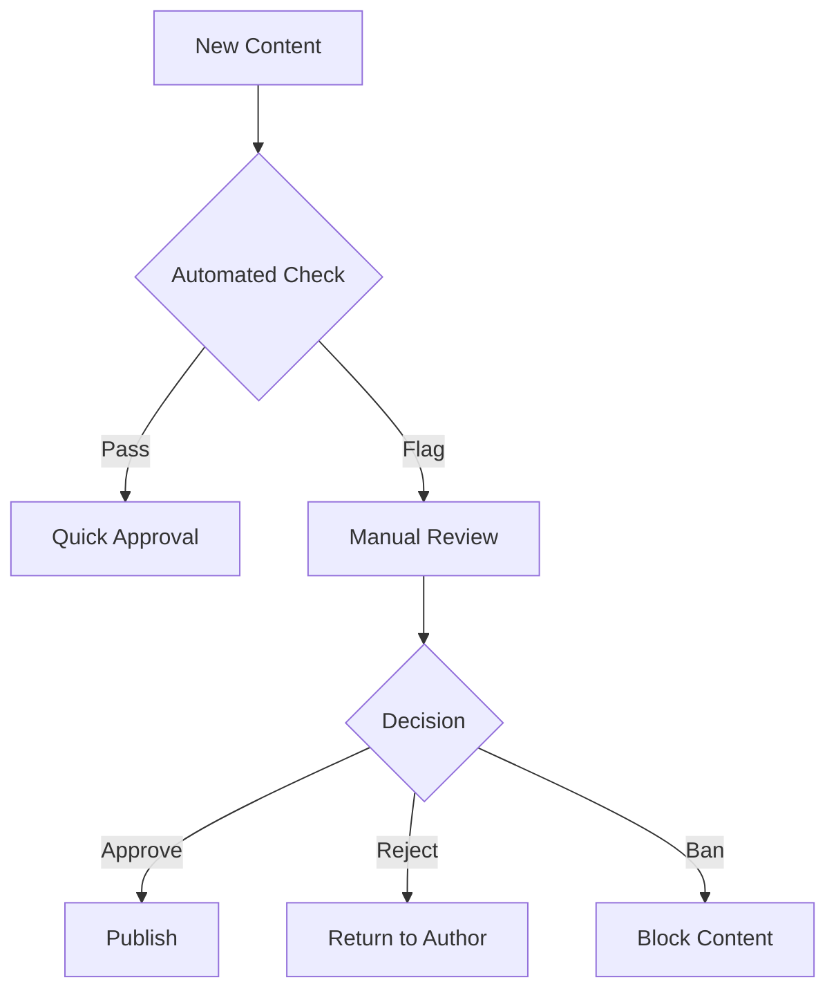
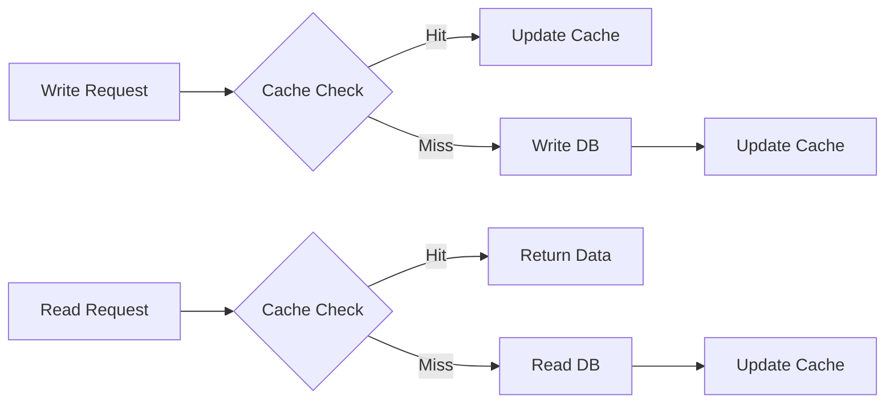
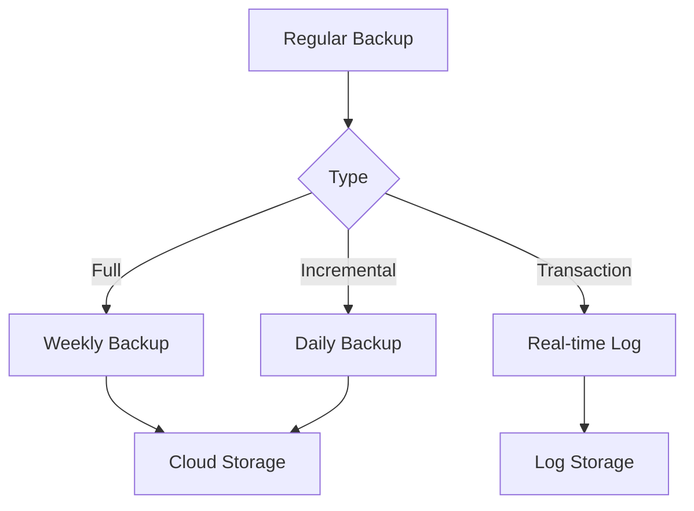
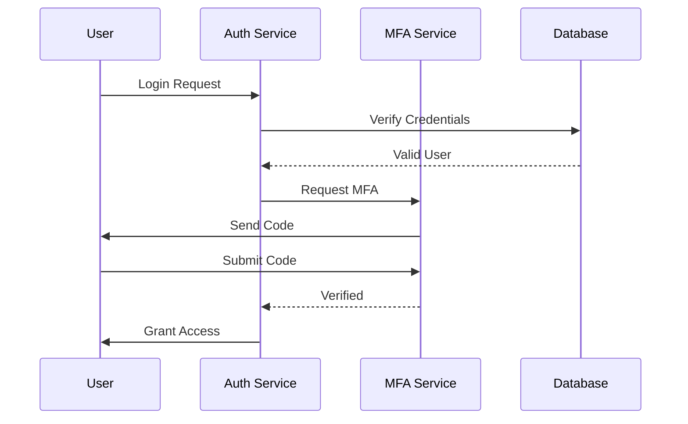
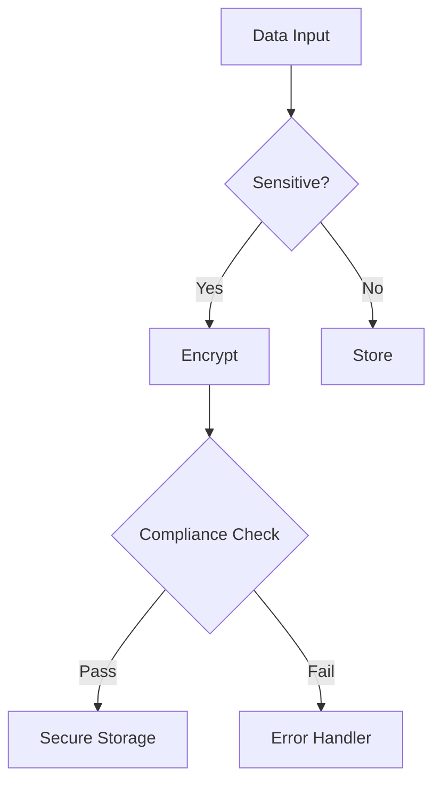

# Fashionista Portal - Core Feature Flow Diagrams

## Event Attendee Journey

## Designer Journey

## Payment Processing Flow

## Third-Party Integration Flow

## Event Approval Process

## Content Moderation Flow

## Database Operations Flow

## Data Backup Flow

## Authentication Flow

## Data Protection Flow
