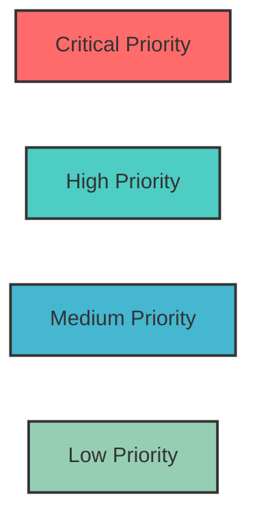
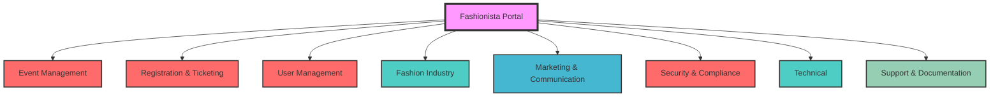
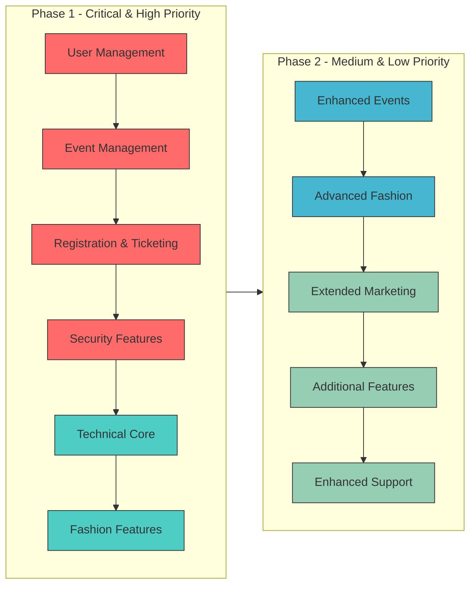
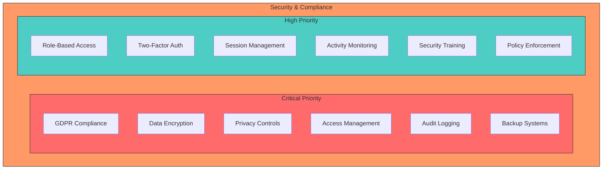
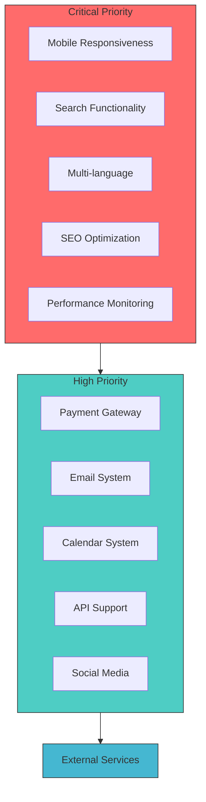
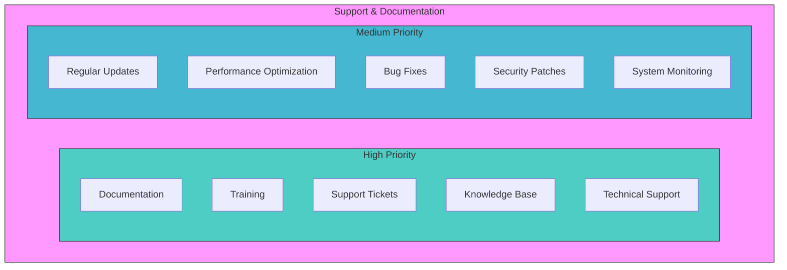
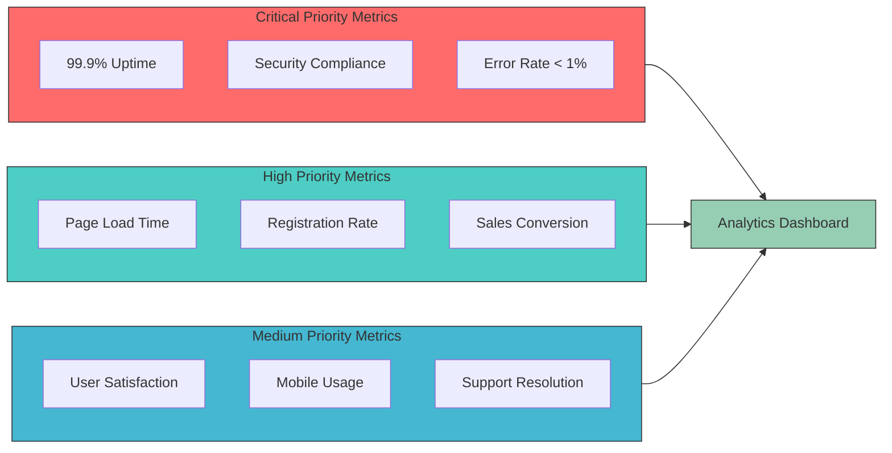
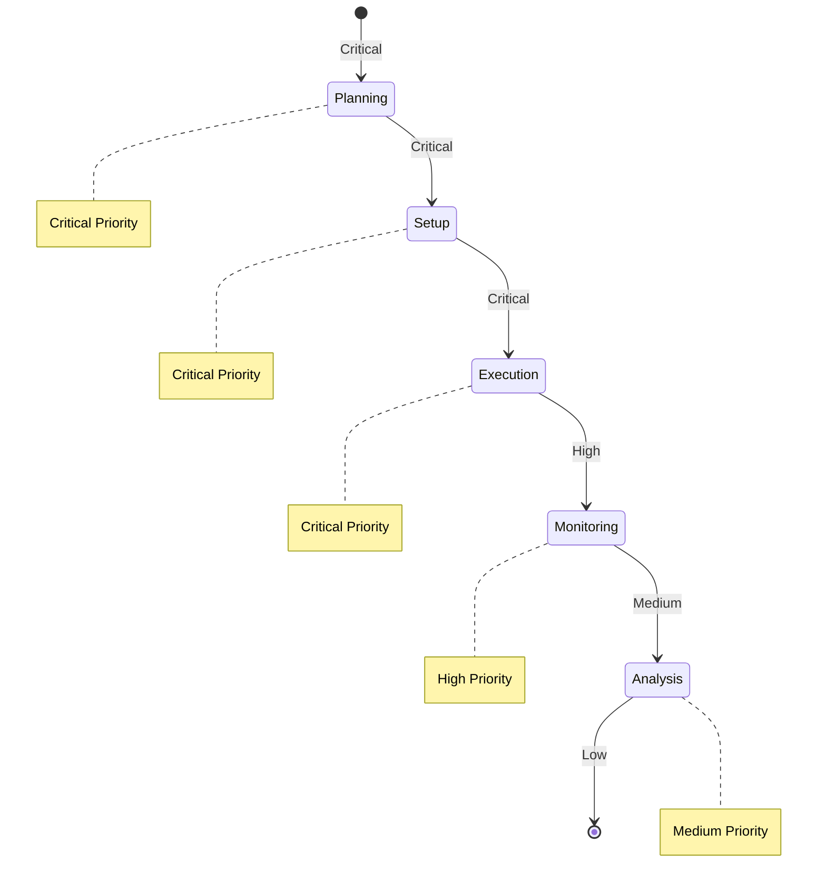

# Fashionista Portal - Core Features Diagrams

## Priority Level Color Coding

## Overview Structure

## Detailed Core Features Breakdown

```mermaid
graph TD
    Root((Core Features)) --> EM[Event Management]
    Root --> RT[Registration & Ticketing]
    Root --> UM[User Management]
    Root --> FI[Fashion Industry]
    
    %% Event Management Breakdown
    EM --> BS[Basic Setup]
    EM --> LC[Lifecycle]
    EM --> IN[Information]
    
    BS --> EC[Event Creation]
    BS --> SM[Schedule Management]
    BS --> VM[Venue Management]
    
    LC --> PE[Pre-event]
    LC --> DE[During-event]
    LC --> PO[Post-event]
    
    IN --> DT[Details]
    IN --> SC[Scheduling]
    IN --> MD[Metadata]
    
    %% Registration & Ticketing Breakdown
    RT --> RS[Registration System]
    RT --> TK[Ticketing]
    RT --> PM[Payment]
    
    RS --> CI[Contact Info]
    RS --> FM[Forms]
    RS --> WL[Waitlists]
    
    TK --> TR[Tiers]
    TK --> PR[Pricing]
    TK --> DL[Delivery]
    
    PM --> PC[Processing]
    PM --> SE[Security]
    PM --> RF[Refunds]
    
    %% User Management Breakdown
    UM --> AC[Account]
    UM --> RL[Roles]
    
    AC --> RG[Registration]
    AC --> PF[Profiles]
    AC --> SY[Security]
    
    RL --> AD[Admin]
    RL --> OR[Organizer]
    RL --> DS[Designer]
    RL --> ML[Model]
    RL --> AT[Attendee]
    
    %% Fashion Industry Breakdown
    FI --> DG[Designer]
    FI --> MD[Model]
    FI --> SH[Show]
    
    DG --> PT[Portfolio]
    DG --> SW[Shows]
    DG --> RQ[Requirements]
    
    MD --> MP[Profiles]
    MD --> MS[Scheduling]
    MD --> FT[Fittings]
    
    SH --> RW[Runway]
    SH --> BK[Backstage]
    SH --> TC[Technical]

    %% Styling
    style Root fill:#f9f,stroke:#333,stroke-width:4px
    style EM fill:#ff6b6b,stroke:#333,stroke-width:2px
    style RT fill:#ff6b6b,stroke:#333,stroke-width:2px
    style UM fill:#ff6b6b,stroke:#333,stroke-width:2px
    style FI fill:#4ecdc4,stroke:#333,stroke-width:2px
```

## Implementation Flow

## Security & Compliance Structure

## Technical Integration Flow

## Support System Structure

## Success Metrics Priority

## Event Management Lifecycle Priority

## Priority Level Definitions
- **Critical Priority (Red - #ff6b6b)**
  - Essential for basic system operation
  - Required for MVP launch
  - Security-critical features
  - Core user functionality

- **High Priority (Teal - #4ecdc4)**
  - Important for user experience
  - Required for full operation
  - Key business features
  - Essential integrations

- **Medium Priority (Blue - #45b7d1)**
  - Enhancement features
  - Performance optimizations
  - Additional functionality
  - User experience improvements

- **Low Priority (Green - #96ceb4)**
  - Nice-to-have features
  - Future enhancements
  - Optional functionality
  - Cosmetic improvements

Remember: 
- Critical and High priority features must be implemented in Phase 1
- Medium and Low priority features can be implemented in Phase 2
- Priority levels may be adjusted based on user feedback and business needs
- Security features are always treated as Critical priority
- Core user functionality is always Critical priority

Remember: These diagrams provide a visual representation of the core features and their relationships. They can be used for:
- Understanding system architecture
- Planning implementation phases
- Training new team members
- Documenting system structure
- Communicating with stakeholders 