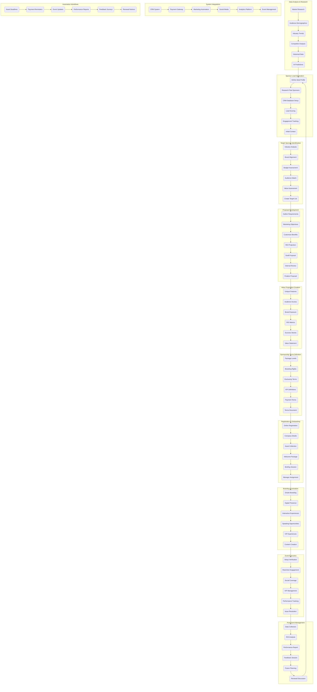
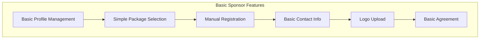
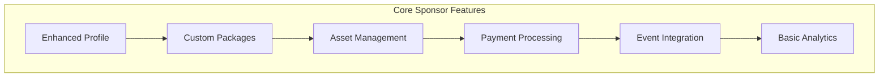
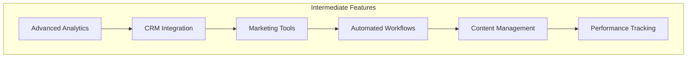
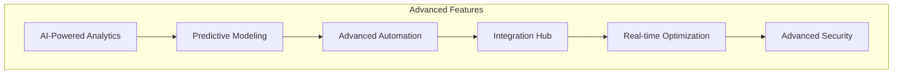
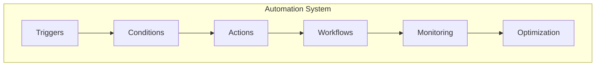
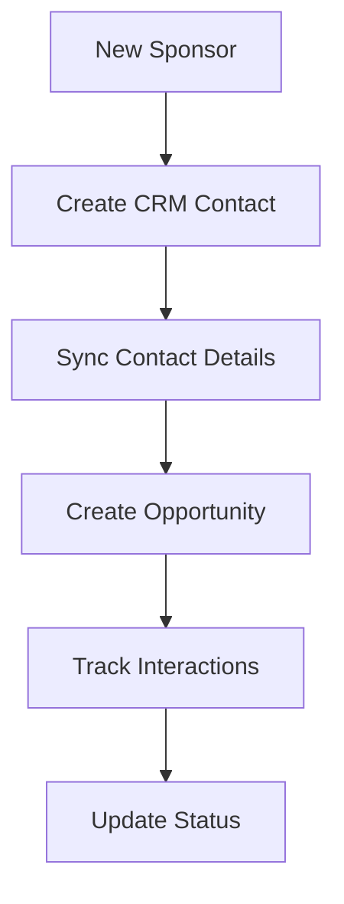
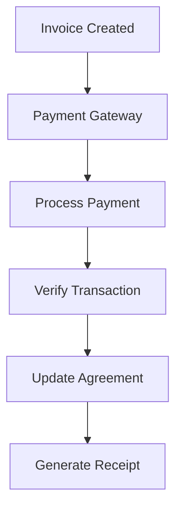
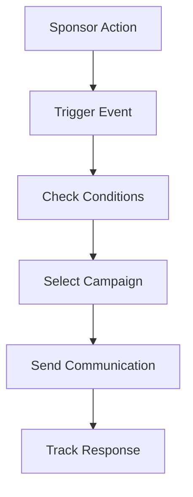

# Sponsor User Flows & Workflows



## Process Descriptions

### 1. Data Analysis & Research
- Conducts comprehensive market research
- Analyzes audience demographics
- Tracks industry trends
- Performs competitor analysis
- Utilizes AI for predictions

### 2. Sponsor Lead Generation
- Defines ideal sponsor profiles
- Researches past sponsorship history
- Sets up CRM tracking
- Implements lead scoring
- Manages initial contact

### 3. Target Sponsor Identification
- Analyzes industry alignment
- Assesses brand compatibility
- Evaluates budget fit
- Matches audience demographics
- Creates prioritized target list

### 4. Proposal Development
- Aligns with marketing objectives
- Customizes benefit packages
- Projects ROI potential
- Creates tailored proposals
- Reviews and finalizes documents

### 5. Value Proposition Creation
- Highlights unique features
- Demonstrates audience access
- Quantifies brand exposure
- Provides ROI metrics
- Showcases success stories

### 6. Sponsorship Terms Definition
- Defines package levels
- Establishes branding rights
- Sets exclusivity terms
- Defines KPI measurements
- Creates comprehensive terms

### 7. Registration & Onboarding
- Streamlines registration process
- Collects company information
- Manages asset submission
- Provides welcome materials
- Assigns dedicated manager

### 8. Branding & Activation
- Manages onsite branding
- Coordinates digital presence
- Creates interactive experiences
- Arranges speaking opportunities
- Delivers VIP experiences

### 9. Event Execution
- Verifies setup completion
- Manages real-time engagement
- Provides social media coverage
- Handles VIP requirements
- Tracks performance metrics

### 10. Post-Event Management
- Collects comprehensive data
- Analyzes ROI achievement
- Generates performance reports
- Gathers sponsor feedback
- Plans future engagements

### 11. System Integrations
- Integrates with CRM platforms
- Manages payment processing
- Automates marketing tasks
- Coordinates social media
- Tracks analytics data

### 12. Automation Workflows
- Manages asset deadlines
- Sends payment reminders
- Provides event updates
- Generates performance reports
- Handles renewal process

## Feature Categorization

### Basic Features (MVP)


1. **Profile Management**
   - Company information
   - Contact details
   - Basic logo upload
   - Simple status tracking

2. **Package Management**
   - Fixed package options
   - Basic pricing tiers
   - Manual package selection
   - Simple benefit lists

3. **Basic Agreements**
   - Standard agreement templates
   - Manual agreement generation
   - Basic payment tracking
   - Simple status updates

### Core Features (Essential)


1. **Enhanced Profile Management**
   - Detailed company profiles
   - Multiple contact management
   - Brand asset library
   - Status workflow

2. **Advanced Package Management**
   - Customizable packages
   - Dynamic pricing
   - Benefit configuration
   - Package comparison

3. **Event Integration**
   - Event calendar integration
   - Basic scheduling
   - Simple resource allocation
   - Attendance tracking

4. **Basic Analytics**
   - Simple ROI tracking
   - Basic performance metrics
   - Standard reports
   - Basic dashboards

### Intermediate Features


1. **Advanced Analytics**
   - Detailed ROI analysis
   - Custom reporting
   - Performance forecasting
   - Trend analysis

2. **Marketing Integration**
   - Social media integration
   - Email campaign management
   - Content scheduling
   - Brand exposure tracking

3. **Automated Workflows**
   - Approval processes
   - Task management
   - Deadline tracking
   - Notification system

4. **Content Management**
   - Digital asset management
   - Content approval workflow
   - Media library
   - Brand guidelines integration

### Advanced Features


1. **AI & Machine Learning**
   - Predictive analytics
   - Sponsor matching
   - Automated lead scoring
   - Performance optimization

2. **Advanced Integrations**
   - Multi-platform integration
   - API management
   - Custom webhooks
   - Third-party extensions

3. **Real-time Features**
   - Live performance tracking
   - Real-time notifications
   - Dynamic content updates
   - Instant reporting

### Automation Framework


1. **Trigger Types**
   - Time-based triggers
   - Event-based triggers
   - Status change triggers
   - User action triggers
   - System event triggers

2. **Automated Actions**
   - Email notifications
   - Status updates
   - Task creation
   - Report generation
   - Payment processing

3. **Workflow Automation**
   - Onboarding workflows
   - Approval processes
   - Content workflows
   - Payment workflows
   - Renewal workflows

4. **Integration Automation**
   - CRM sync
   - Payment processing
   - Marketing automation
   - Analytics updates
   - Document generation

### Implementation Priority
1. **Phase 1: Basic Features**
   - Essential profile management
   - Simple package selection
   - Basic agreement handling
   - Manual processes support

2. **Phase 2: Core Features**
   - Enhanced profiles
   - Custom packages
   - Payment processing
   - Basic analytics

3. **Phase 3: Intermediate Features**
   - Advanced analytics
   - CRM integration
   - Automated workflows
   - Content management

4. **Phase 4: Advanced Features**
   - AI/ML capabilities
   - Advanced integrations
   - Real-time features
   - Advanced security

5. **Phase 5: Automation Framework**
   - Trigger system
   - Workflow engine
   - Integration hub
   - Monitoring system

## Database Triggers

### Sponsor Status Updates
```sql
CREATE OR REPLACE FUNCTION trigger_sponsor_status_update()
RETURNS TRIGGER AS $$
BEGIN
    -- Update related records when sponsor status changes
    IF NEW.status != OLD.status THEN
        -- Update agreements
        UPDATE sponsor_agreements
        SET status = CASE 
            WHEN NEW.status = 'inactive' THEN 'suspended'
            WHEN NEW.status = 'active' THEN 'active'
            ELSE status
        END
        WHERE sponsor_id = NEW.id;
        
        -- Update event participation
        UPDATE event_sponsors
        SET status = CASE 
            WHEN NEW.status = 'inactive' THEN 'suspended'
            WHEN NEW.status = 'active' THEN 'active'
            ELSE status
        END
        WHERE sponsor_id = NEW.id;
    END IF;
    RETURN NEW;
END;
$$ LANGUAGE plpgsql;
```

### Agreement Status Updates
```sql
CREATE OR REPLACE FUNCTION trigger_agreement_status_update()
RETURNS TRIGGER AS $$
BEGIN
    -- Update related records when agreement status changes
    IF NEW.status != OLD.status THEN
        -- Update event sponsorships
        UPDATE event_sponsors
        SET status = NEW.status
        WHERE sponsor_id = NEW.sponsor_id
        AND event_id = NEW.event_id;
        
        -- Update sponsor benefits
        UPDATE sponsor_benefits
        SET is_active = CASE 
            WHEN NEW.status = 'active' THEN true
            ELSE false
        END
        WHERE agreement_id = NEW.id;
    END IF;
    RETURN NEW;
END;
$$ LANGUAGE plpgsql;
```

## Automated Notifications

### Status Change Notifications
```sql
CREATE OR REPLACE FUNCTION notify_status_change()
RETURNS TRIGGER AS $$
BEGIN
    -- Insert notification
    INSERT INTO notifications (
        user_id,
        type,
        title,
        message,
        data
    )
    SELECT 
        user_id,
        'sponsor_status_change',
        'Sponsor Status Updated',
        format('Sponsor status changed from %s to %s', OLD.status, NEW.status),
        jsonb_build_object(
            'sponsor_id', NEW.id,
            'old_status', OLD.status,
            'new_status', NEW.status
        )
    FROM sponsor_users
    WHERE sponsor_id = NEW.id;
    
    RETURN NEW;
END;
$$ LANGUAGE plpgsql;
```

### Payment Reminders
```sql
CREATE OR REPLACE FUNCTION notify_payment_due()
RETURNS TRIGGER AS $$
BEGIN
    -- Check for upcoming payments
    IF NEW.next_payment_date - CURRENT_DATE <= 7 THEN
        -- Insert notification
        INSERT INTO notifications (
            user_id,
            type,
            title,
            message,
            data
        )
        SELECT 
            user_id,
            'payment_reminder',
            'Payment Due Soon',
            format('Payment of %s due on %s', NEW.payment_amount, NEW.next_payment_date),
            jsonb_build_object(
                'agreement_id', NEW.id,
                'amount', NEW.payment_amount,
                'due_date', NEW.next_payment_date
            )
        FROM sponsor_users
        WHERE sponsor_id = NEW.sponsor_id;
    END IF;
    
    RETURN NEW;
END;
$$ LANGUAGE plpgsql;
```

## Integration Workflows

### CRM Integration


### Payment Integration


### Marketing Automation
